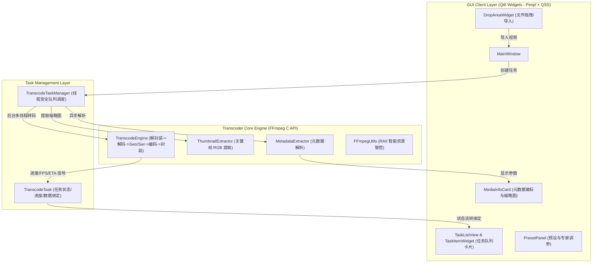

# 🎬 FFmpeg Native Video Transcoder (桌面视频格式转换器)

基于 **Qt 6 (C++17)** 与 **原生 FFmpeg C API**（libavcodec、libavformat、libswscale、libswresample）打造的现代化跨平台桌面视频格式转换器客户端。

本项目作为专业级技术评测实现，**不调用任何 `ffmpeg.exe` 命令行进程**，全链路直接调用底层 C 函数完成解封装、音视频解码、图像尺寸与色彩空间转换、音频重采样、编码以及容器封装；架构上严格遵循 **Pimpl 模式** 与 **QSS 动态样式解耦**，面向真实用户设计，具备直观的高品质交互体验与工业级稳定性。

---

## 🌟 核心功能特性

### 1. 媒体信息解析与高清缩略图截取
- **多维流元数据解析**：自动解析容器格式（MP4、MKV、MOV、AVI、FLV、TS、WebM 等）、总时长、整体码率、文件大小、音视频流编码类型（H.264/AVC、H.265/HEVC、AAC、MP3 等）、分辨率、像素格式（如 YUV420P）、帧率及声道采样率。
- **智能关键帧缩略图提取**：利用 `av_seek_frame` 避开片头黑屏，通过 `sws_scale` 转换为高质量 RGB24 图像并动态缓存渲染。

### 2. 全链路 FFmpeg C API 原生转码流水线
- **底层 C 函数驱动**：
  - 解封装：`avformat_open_input` / `avformat_find_stream_info`
  - 解码：`avcodec_send_packet` / `avcodec_receive_frame`
  - 图像处理：`sws_scale`（支持任意目标分辨率缩放与色彩空间转换）
  - 音频处理：`swr_convert`（采样率重采样、声道重映射）+ `AVAudioFifo`（平滑音频帧缓存）
  - 编码：`avcodec_send_frame` / `avcodec_receive_packet`（支持 `libx264` / `libx265` / `aac` / `mp3`）
  - 封装：`avformat_write_header` / `av_interleaved_write_frame` / `av_write_trailer`
  - 时间戳精准同步：`av_packet_rescale_ts` 消除音画不同步。
- **视频转音频提取**：一键提取 MP3 (支持 128k~320kbps 录音室级) / AAC 高保真音频。
- **丰富的预设与专家调参**：
  - 快速预设：通用 MP4 (H.264+AAC)、高效 MKV (H.265)、提取 MP3/AAC、Apple MOV、专家模式。
  - 参数调节：分辨率（原始/4K/1080P/720P/480P）、帧率（原始/60/30/24 fps）、CRF 恒定画质（18~35）与目标码率、编码速度预设（ultrafast ~ slow）。

### 3. 多任务批处理队列与实时状态监测
- **批处理队列调度**：支持多文件同时拖拽导入，队列化安全调度。
- **实时性能指标**：转换百分比、编码帧率 (FPS)、实时转码倍速 (如 15.1x / 120x)、已耗时与预估剩余时间 (ETA)。
- **精细化状态机控制**：支持单任务或全部任务的 **开始、暂停、继续、取消、移除**；转码完成后支持一键在资源管理器中定位输出文件。

### 4. 现代化客户端交互与动态样式体系
- **桌面原生体验**：大面积文件拖拽导入、双栏响应式布局。
- **严格遵循 Pimpl 设计模式**：所有组件对外头文件隐藏实现细节，指针生命周期安全可控。
- **QSS 动态样式解耦**：C++ 代码无硬编码内联样式，统一通过 `Q_PROPERTY` 暴露状态属性，配合暗色影视风格主题表（`theme.qss`）实现属性选择器动态换肤与渲染刷新。

---

## 🏛️ 系统架构设计



---

## 📁 目录结构

```text
ffmpeg_transform/
├── CMakeLists.txt                         # 现代化 Target-based CMake 构建配置
├── .gitignore                             # Git 过滤规则
├── README.md                              # 项目说明文档
├── session_summary.md                     # 会话技术决策与设计反思总结文档
├── skill.md                               # C++ SDK 工程设计规范准则
├── 3rdparty/                              # 第三方 SDK
│   ├── ffmpeg/                            # FFmpeg 头文件、导入库与运行时 DLL
│   └── sdl2/                              # SDL2 头文件与库
├── src/
│   ├── main.cpp                           # 桌面程序入口点
│   ├── core/                              # 核心转码引擎与 FFmpeg 底层封装
│   │   ├── CommonTypes.h                  # 核心数据模型与配置结构体
│   │   ├── FFmpegUtils.h / .cpp           # RAII 资源释放器与错误辅助类
│   │   ├── MetadataExtractor.h / .cpp     # 视频信息提取器 (Pimpl)
│   │   ├── ThumbnailExtractor.h / .cpp    # 视频缩略图提取器 (Pimpl)
│   │   └── TranscodeEngine.h / .cpp       # FFmpeg C API 转码流水线引擎 (Pimpl)
│   ├── manager/                           # 任务调度与队列管理
│   │   ├── TranscodeTask.h / .cpp         # 单任务实体模型 (Pimpl)
│   │   └── TranscodeTaskManager.h / .cpp  # 任务队列与并发调度器 (Pimpl)
│   ├── ui/                                # Qt6 客户端界面组件 (严格 Pimpl)
│   │   ├── MainWindow.h / .cpp            # 主窗口
│   │   ├── DropAreaWidget.h / .cpp        # 拖拽放置控件
│   │   ├── MediaInfoCard.h / .cpp         # 元数据与缩略图展示卡片
│   │   ├── PresetPanel.h / .cpp           # 预设与参数设置面板
│   │   ├── TaskItemWidget.h / .cpp        # 任务卡片行控件
│   │   └── TaskListView.h / .cpp          # 任务卡片列表容器
│   └── resources/                         # 资源与动态样式
│       ├── app.qrc                        # Qt 资源文件
│       └── styles/
│           └── theme.qss                  # 专业暗色影视风格 QSS 样式表
└── tests/
    └── test_transcoder.cpp                # 核心功能控制台集成测试程序
```

---

## 🛠️ 构建与运行指南

### 1. 环境依赖
- **操作系统**：Windows 10 / 11 (x64)
- **编译器**：Microsoft Visual Studio 2022 (MSVC v143, x64)
- **构建工具**：CMake >= 3.20
- **Qt 框架**：Qt 6.8+ (MSVC 2022 64-bit)

### 2. 编译步骤
```powershell
# 1. 产生构建目录 (指定 Qt6 路径)
cmake -B build -G "Visual Studio 17 2022" -A x64 -DCMAKE_PREFIX_PATH="E:/QT1/6.8.3/msvc2022_64"

# 2. 编译 Release 版本 (构建完成将自动拷贝 FFmpeg DLL 到二进制目录)
cmake --build build --config Release
```

### 3. 运行测试
```powershell
# 运行核心自动化测试集 (元数据读取、缩略图提取、MP4->MP3 音频提取、MP4->MKV 视频转码)
.\build\Release\test_transcoder.exe
```

### 4. 启动客户端
```powershell
# 启动 Qt6 桌面图形客户端
.\build\Release\FFmpegVideoTransform.exe
```

---

## 📊 测试与验证结果

通过实际视频样本（`v1.mp4`, 25MB, 852x480 H.264 AAC）进行全流程自动化测试：
1. **元数据解析**：100% 精确识别容器格式、时长 (03:32)、宽高 (852x480)、流编码、帧率与音频采样率。
2. **缩略图生成**：成功截取第 8% 时刻关键帧并转换为 480x270 RGB24 图像，避开片头黑屏。
3. **音频提取转码**：MP4 -> MP3 (192kbps)，转码倍率达到 **120.5x**，生成有效 MP3 音频。
4. **视频缩放转码**：MP4 (852x480) -> MKV (1280x720 720P H.264)，帧率达到 **374 FPS (15.1x)**，音画同步完整。
