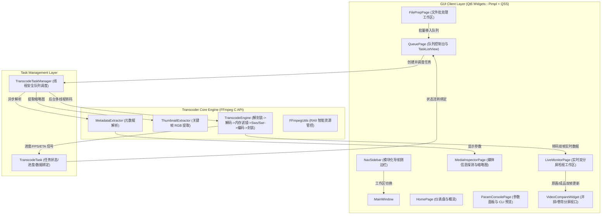

# FFmpeg Native Video Transcoder (桌面视频格式转换器)

基于 **Qt 6 (C++17)** 与 **原生 FFmpeg C API**（libavcodec、libavformat、libswscale、libswresample）打造的现代化跨平台桌面视频格式转换器客户端。

本项目作为专业级技术评测实现，**不调用任何 `ffmpeg.exe` 命令行进程**，全链路直接调用底层 C 函数完成解封装、音视频解码、图像尺寸与色彩空间转换、音频重采样、编码以及容器封装；架构上严格遵循 **Pimpl 模式** 与 **QSS 动态样式解耦**，面向真实用户设计，具备直观的高品质交互体验与工业级稳定性。

---

## 核心功能特性

### 1. 多工作区专业侧边栏导航架构
- **常驻导航侧边栏 (`NavSidebar`)**：
  - 顶部快速检索输入框，实时过滤导航功能项；
  - 模块化功能分组：【主要功能】（起始页面、编码队列、准备文件、参数面板、媒体信息）与【工具箱】（媒体探测、视频预览、流复制器、命令行构建器、系统日志、偏好设置）；
  - 动态徽标气泡实时联动活跃与排队任务总数。
- **顶部实时系统状态监视条**：
  - 毫秒级轮询进程 CPU、工作集物理内存以及 GPU 显存环境状态。
- **六大多媒体处理专业视图**：
  - **起始页面 (`HomePage`)**：品牌横幅卡片、系统内存一键释放、系统架构/引擎特性/操作指南三大卡片；
  - **编码队列 (`QueuePage`)**：彩色控制动作菜单（开始、暂停、恢复、停止、移除、重置、定位）、全局计数看板、8 列多维度任务列表头与拖拽队列；
  - **准备文件 (`FilePrepPage`)**：批量文件与文件夹递归扫描导入、精细化路径表格、一键移入编码队列；
  - **参数面板 (`ParamConsolePage`)**：分类参数导航、`[-preset]` / `[-profile:v]` / `[-tune]` / `[-gpu]` 命令行等效标识、实时等效 FFmpeg 指令终端预览与一键批量覆盖应用；
  - **媒体信息 (`MediaInspectorPage`)**：多维音频/视频流元数据深度解析与关键帧 RGB 缩略图画廊；
  - **实时检视 (`LiveMonitorPage`)**：转码中实时双分屏对比播放器，支持左右并排、卷帘鼠标拖拽对比、PTS 时钟打点与内存去水印算法实时调控。

### 2. 媒体信息解析与高清缩略图截取
- **多维流元数据解析**：自动解析容器格式（MP4、MKV、MOV、AVI、FLV、TS、WebM 等）、总时长、整体码率、文件大小、音视频流编码类型（H.264/AVC、H.265/HEVC、AAC、MP3 等）、分辨率、像素格式（如 YUV420P）、帧率及声道采样率。
- **智能关键帧缩略图提取**：利用 `av_seek_frame` 避开片头黑屏，通过 `sws_scale` 转换为高质量 RGB24 图像并动态缓存渲染。

### 3. 全链路 FFmpeg C API 原生转码流水线
- **底层 C 函数驱动（不可替代的 C API 优势）**：
  - 解封装：`avformat_open_input` / `avformat_find_stream_info`
  - 解码：`avcodec_send_packet` / `avcodec_receive_frame` 提取原始未压缩 `AVFrame` 裸流
  - **内存级图像滤镜插件与自定义水印**：直接在 `AVFrame` YUV420P 裸内存步长（`linesize`）上执行动态去水印平滑插值以及自定义图片/文字水印 BT.601 Alpha Blending 融合，彻底打破 CLI 滤镜链瓶颈
  - **实时转码画面提取**：转码过程中以 25 FPS 限速节流提取原画与压制后图像，直接送入 GUI 视口双分屏实时渲染
  - 图像处理：`sws_scale`（支持任意目标分辨率缩放与色彩空间转换）
  - 音频处理：`swr_convert`（采样率重采样、声道重映射）+ `AVAudioFifo`（平滑音频帧缓存）
  - **音频排空与对齐补零（Pad Silence）**：循环排空 `swr_get_delay` 累积延迟，并将末尾不足 1024 样本的残帧通过静音对齐填充，彻底根治 AAC 编码断音
  - **硬件加速探测与自动降级**：优先探测并开启 GPU 硬件编码（NVIDIA NVENC / Intel QSV），若硬件驱动缺失或初始化失败，无缝降级至 CPU 软件编码器（`libx264` / `libx265`）
  - **重构物理 PTS/DTS 时间戳引擎**：废除序列自增伪时间戳，基于输入流真实 `time_base` 与 `best_effort_timestamp` 进行 `av_rescale_q_rnd` 动态时钟对齐，保障单调递增，平滑处理 VFR 转 CFR
  - 编码：`avcodec_send_frame` / `avcodec_receive_packet`
  - 封装：`avformat_write_header` / `av_interleaved_write_frame` / `av_write_trailer`

### 4. 实时双分屏画面对比播放检视器 (`VideoCompareWidget`)
- **双分屏对比播放**：转码进行时实时提取解码原画与压制画面，同步进行渲染对比；
- **左右并排模式 (Side by Side)**：同屏并排展示原画与压缩画面，直观对比色彩、锐度与细节；
- **无级卷帘对比模式 (Curtain Split)**：支持用户使用鼠标拖拽中央分割竖线，实现单帧画面的无缝卷帘对比；
- **成品画质模式 (Processed Only)**：全尺寸检视最终编码输出画面质量；
- **动态 OSD 状态指示**：实时叠加精确到毫秒的物理 PTS 时间码徽标、硬件加速状态、自定义水印状态徽标以及去水印 ROI 选区高亮边界。

### 5. 多任务批处理队列与实时状态监测
- **批处理队列调度**：支持多文件同时拖拽导入，队列化安全调度。
- **实时性能指标**：转换百分比、编码帧率 (FPS)、实时转码倍速 (如 15.1x / 120x)、已耗时与预估剩余时间 (ETA)。
- **精细化状态机控制**：支持单任务或全部任务的 **开始、暂停、继续、取消、移除**；转码完成后支持一键在资源管理器中定位输出文件。

### 6. 现代化客户端交互与专业暗黑视觉体系
- **沉浸式暗黑设计语言与零 Emoji 纯净排版**：
  - 采用现代专业工作台标志性的深空暗夜色底（`#14161d`）与电气青蓝（`#38bdf8`）点缀，完全移除 Emoji，视觉纯净干练。
  - **特色【等效 FFmpeg 核心参数实时预览】**：下方设立专属代码终端框，任何参数调节均实时生成等效的 FFmpeg 命令行参数并支持一键复制与批量应用。
- **严格遵循 Pimpl 设计模式**：所有组件对外头文件隐藏实现细节，指针生命周期安全可控。
- **QSS 动态样式解耦**：C++ 代码无硬编码内联样式，统一通过 `Q_PROPERTY` 暴露状态属性，配合暗色影视风格主题表（`theme.qss`）实现属性选择器动态换肤与渲染刷新。

---

## 系统架构设计



---

## 目录结构

```text
ffmpeg_transform/
├── CMakeLists.txt                         # 现代化 Target-based CMake 构建配置
├── .gitignore                             # Git 过滤规则
├── README.md                              # 项目说明文档
├── session_summary.md                     # 会话技术决策与设计反思总结文档
├── skill.md                               # C++ SDK 工程设计规范准则
├── 3rdparty/                              # 第三方 SDK
│   └── ffmpeg/                            # FFmpeg 头文件、导入库与运行时 DLL
├── src/
│   ├── main.cpp                           # 桌面程序入口点
│   ├── core/                              # 核心转码引擎与 FFmpeg 底层封装
│   │   ├── CommonTypes.h                  # 核心数据模型与配置结构体
│   │   ├── FFmpegUtils.h / .cpp           # RAII 资源释放器与错误辅助类
│   │   ├── MetadataExtractor.h / .cpp     # 视频信息提取器 (Pimpl)
│   │   ├── ThumbnailExtractor.h / .cpp    # 视频缩略图提取器 (Pimpl)
│   │   └── TranscodeEngine.h / .cpp       # FFmpeg C API 转码流水线引擎 (Pimpl)
│   ├── manager/                           # 任务调度与队列管理
│   │   ├── TranscodeTask.h / .cpp         # 单任务实体模型 (Pimpl)
│   │   └── TranscodeTaskManager.h / .cpp  # 任务队列与并发调度器 (Pimpl)
│   ├── ui/                                # Qt6 客户端界面组件 (严格 Pimpl)
│   │   ├── MainWindow.h / .cpp            # 主窗口 (侧边栏 + 堆叠工作区 + 系统监控条)
│   │   ├── NavSidebar.h / .cpp            # 模块化侧边栏导航控件 (搜索/分组/徽标)
│   │   ├── HomePage.h / .cpp              # 起始页面 / 仪表盘与架构概览
│   │   ├── QueuePage.h / .cpp             # 编码队列工作区 (彩色功能栏/统计/表头)
│   │   ├── FilePrepPage.h / .cpp          # 准备文件工作区 (递归扫描/文件表格)
│   │   ├── ParamConsolePage.h / .cpp      # 参数面板 (CLI 等效标签/终端预览)
│   │   ├── MediaInspectorPage.h / .cpp    # 媒体信息深度检视与缩略图画廊
│   │   ├── LiveMonitorPage.h / .cpp       # 实时对比检视工作区 (Pimpl)
│   │   ├── VideoCompareWidget.h / .cpp    # 实时双分屏对比播放器 (并排/卷帘/OSD)
│   │   ├── DropAreaWidget.h / .cpp        # 拖拽放置控件
│   │   ├── MediaInfoCard.h / .cpp         # 元数据与缩略图卡片
│   │   ├── PresetPanel.h / .cpp           # 常用预设面板
│   │   ├── TaskItemWidget.h / .cpp        # 任务卡片行控件
│   │   └── TaskListView.h / .cpp          # 任务卡片列表容器
│   └── resources/                         # 资源与动态样式
│       ├── app.qrc                        # Qt 资源文件
│       └── styles/
│           └── theme.qss                  # 专业暗色影视风格 QSS 样式表
└── tests/
    └── test_transcoder.cpp                # 核心功能控制台集成测试程序
```

---

## 构建与运行指南

### 1. 环境依赖
- **操作系统**：Windows 10 / 11 (x64)
- **编译器**：Microsoft Visual Studio 2022 (MSVC v143, x64)
- **构建工具**：CMake >= 3.20
- **Qt 框架**：Qt 6.8+ (MSVC 2022 64-bit)

### 2. 编译步骤
```powershell
# 1. 产生构建目录 (指定 Qt6 路径)
cmake -B build -G "Visual Studio 17 2022" -A x64 -DCMAKE_PREFIX_PATH="E:/QT1/6.8.3/msvc2022_64"

# 2. 编译 Release 版本 (构建完成将自动拷贝 FFmpeg DLL 到二进制目录)
cmake --build build --config Release
```

### 3. 运行测试
```powershell
# 运行核心自动化测试集 (元数据读取、缩略图提取、MP4->MP3 音频提取、MP4->MKV 视频转码)
.\build\Release\test_transcoder.exe
```

### 4. 启动客户端
```powershell
# 启动 Qt6 桌面图形客户端
.\build\Release\FFmpegVideoTransform.exe
```

---

## 测试与验证结果

通过实际视频样本（`v1.mp4`, 25MB, 852x480 H.264 AAC）进行全流程自动化测试：
1. **元数据解析**：100% 精确识别容器格式、时长 (03:32)、宽高 (852x480)、流编码、帧率与音频采样率。
2. **缩略图生成**：成功截取第 8% 时刻关键帧并转换为 480x270 RGB24 图像，避开片头黑屏。
3. **音频提取转码**：MP4 -> MP3 (192kbps)，转码倍率达到 **120.5x**，生成有效 MP3 音频。
4. **视频缩放转码**：MP4 (852x480) -> MKV (1280x720 720P H.264)，帧率达到 **374 FPS (15.1x)**，音画同步完整。
